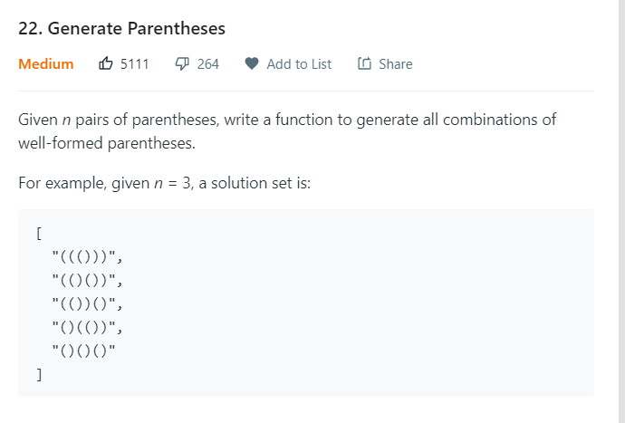

# Generate Parentheses

[leetcode 22](https://leetcode.com/problems/generate-parentheses/)



### DFS + Backtracking

We can find that bracket "(" is always before the bracket ")", so I choose to use dfs by recursively add the open bracket "(" and then close it by ")".

To track how many bracket we have to close and how many bracket we have already closed, we use two variables `open` and `close` to keep track of it.

`n` is the maximum pair of parentheses, so both `open` and `close` should be no larger than `n`, and `open + close <= n` as well.

In what case will we get the answer? `close == n`. That means we already have n closed pairs.

In what case can we add new open bracket "(" ? `open + close < n`. That means we can add more pairs of parentheses.
After this the open ones increase by 1.

In what case can we add new close bracket ")"? `open > 0`. That means we still have open bracket "(" to close.
After this the close ones increase by 1, while open ones decrease by 1.

**Note that: Everytime we finish one path of dfs, we should remove our added brackets, which means backtracking.**

Code here:

```java
class Solution {
    public List<String> generateParenthesis(int n) {
        List<String> res = new ArrayList<>();
        dfs(res, n, new StringBuilder(), 0, 0);
        return res;
    }

    private void dfs(List<String> res, int n, StringBuilder sb, int open, int close) {
        if (close == n) {
            res.add(sb.toString());
            return;
        }
        if (open + close < n) {
            sb.append('(');
            dfs(res, n, sb, open+1, close);
            sb.deleteCharAt(sb.length()-1);
        }
        if (open > 0) {
            sb.append(')');
            dfs(res, n, sb, open-1, close+1);
            sb.deleteCharAt(sb.length()-1);
        }      
    }
}
```
