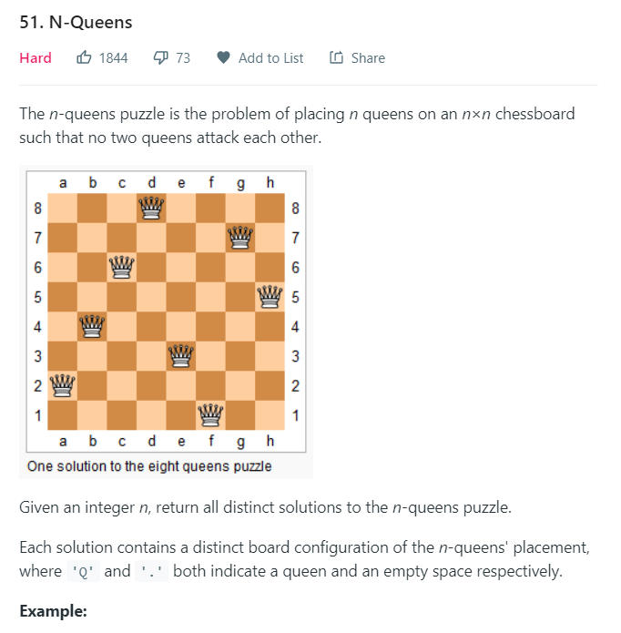
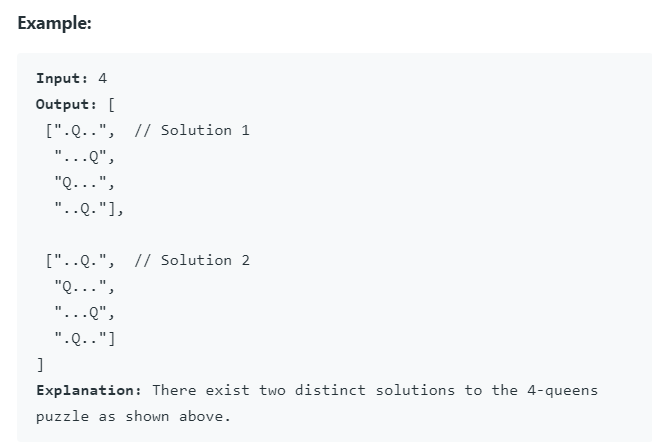

# N-Queens

[leetcode 51](https://leetcode.com/problems/n-queens/)





### DFS+Backtracking

Although it is a hard problem, the logic behind it is also typical backtracking.

In each dfs recursion process, I find possible solution for **one row**. I iterate over this row to find out every valid location of queen, and add it to the grid then recursively work on the next row. After this I reset the queen `'Q'` to blank `'.'` and remove the current row from the grid then continue the loop, which is literally very simple backtracking philosophy.

The tricky part is in the validation process: we should check:

1. No other queens in the same column of the grid.
2. No other queens in the (+-1, +-1) diagonal of the grid.
3. No other queens in the (+-1, -+1) diagonal of the grid.

Here is my code:

```java
class Solution {
    public List<List<String>> solveNQueens(int n) {
        List<List<String>> res = new ArrayList<>();
        dfs(res, n, new ArrayList<>());
        return res;
    }

    private void dfs(List<List<String>> res, int n, List<String> grid) {
        if (grid.size() == n) {
            res.add(new ArrayList<>(grid));
            return;
        }
        StringBuilder curr_row = new StringBuilder();
        for (int i = 0; i < n; i++) {
            curr_row.append('.');
        }
        for (int i = 0; i < n; i++) {
            if (valid(i, grid, n)) {
                curr_row.setCharAt(i, 'Q');
                grid.add(curr_row.toString());
                dfs(res, n, grid);
                curr_row.setCharAt(i, '.');
                grid.remove(grid.size()-1);
            }
        }
    }

    private boolean valid(int col, List<String> grid, int n) {
        //check the column
        for (int i = 0; i < grid.size(); i++) {
            if (grid.get(i).charAt(col) == 'Q') return false;
        }
        int row = grid.size();

        //check the (+-1, +-1) diagonal
        int curr_row = row - 1;
        int curr_col = col - 1;
        while (curr_row >= 0 && curr_col >= 0) {
            if (grid.get(curr_row).charAt(curr_col) == 'Q') return false;
            curr_row--;
            curr_col--;
        }

        //check the (+-1, -+1) diagonal
        curr_row = row - 1;
        curr_col = col + 1;
        while (curr_row >= 0 && curr_col < n) {
            if (grid.get(curr_row).charAt(curr_col) == 'Q') return false;
            curr_row--;
            curr_col++;
        }
        return true;
    }
}
```
