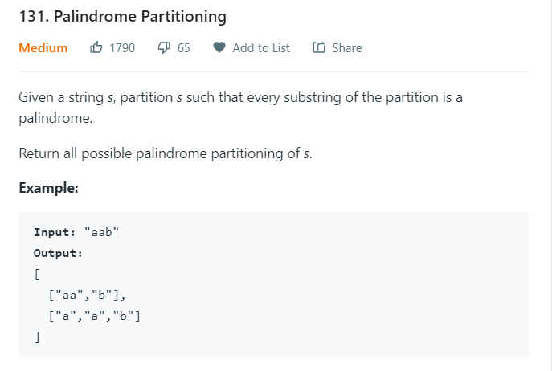

# Palindrome Partitioning

[leetcode 131](https://leetcode.com/problems/palindrome-partitioning/)



### DFS+Backtracking

The basic thoughts on this problem is quite simple: recursively split the string into several palindrome substrings. If the string cannot be splitted anymore, we add these splitted substrings into our result set.

I choose to use the `start` variable to keep track of the rest of the string I need to split: in the range `[start, s.length()-1]`.

In every dfs step, I iterate over `[start, s.length()-1]` to determine the first valid palindrome substring: `[start, i+1)`. I use a simple validation method to validate it. If it is a palindrome, I add it to the `comb`, and recursively call the dfs method with the new `start = i+1`.

If `start == s.length()`, we can add `comb` into our result set.

Here is the code:

```java
class Solution {
    public List<List<String>> partition(String s) {
        List<List<String>> res = new ArrayList<>();
        dfs(res, s, 0, new ArrayList<>());
        return res;
    }

    private void dfs(List<List<String>> res, String s, int start, List<String> comb) {
        if (start == s.length()) {
            res.add(new ArrayList<>(comb));
            return;
        }
        for (int i = start; i < s.length(); i++) {
            String str = s.substring(start, i+1);
            if (isPalindrome(str)) {
                comb.add(str);
                dfs(res, s, i+1, comb);
                comb.remove(comb.size()-1);
            }
        }
    }

    private boolean isPalindrome(String s) {
        int l = 0;
        int r = s.length()-1;
        while (l < r) {
            if (s.charAt(l) != s.charAt(r)) return false;
            l++;
            r--;
        }
        return true;
    }
}
```
