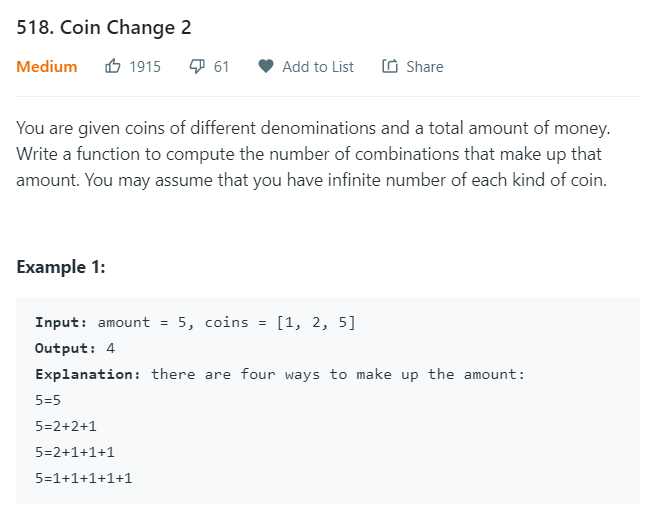

# Coin Change 2

[Leetcode 518](https://leetcode.com/problems/coin-change-2/)



### 1. DFS + Backtracking:

Because we want to find all the possible combinations of the given amount, it is easy for me to come up with the backtracking methods:

```java
public int change(int amount, int[] coins) {
    return dfs(amount, coins, 0);
}

private int dfs(int amount, int[] coins, int p) {
    if (amount < 0) return 0;
    if (amount == 0) return 1;
    int res = 0;
    for (int i = p; i < coins.length; i++) {
        int coin = coins[i];
        int subres = dfs(amount-coin, coins, i);
        res += subres;
    }
    return res;
}
```

In order to eliminate the duplicates, I choose to deliver the pointer p in my recursion process. This pointer indicates before which coin we have completed our combination: if ```p = 3```, we have chosen the first 4 coins (```coins[0] ~ coins[3]```) for the combination, so in the next step we should only choose ```coins[i] (i > p)```, which can avoid duplicates.

However, the time complexity will be ```O(N^amount)```, which is exponential. Time limit exceeeded.

### 2. Dynamic Programming:

The first TLE approach forces me to think of dp to reduce the time complexity.

Consider a 2D dp array ```dp[i][j]```, i refers to the amount we need to get, which is from 0 to ```amount```; j refers to that we use the first j coins to make the combination, which is from 0 to ```coins.length+1```.

For the first example: ```amount = 5, coins = [1, 2, 3]```, we can build our dp array like this:

|     | 0   | 1   | 2   | 3   | 4   | 5   |
| --- | --- | --- | --- | --- | --- | --- |
| 0   | 1   | 0   | 0   | 0   | 0   | 0   |
| 1   | 1   | 1   | 1   | 1   | 1   | 1   |
| 2   | 1   | 1   | 2   | 2   | 3   | 3   |
| 3   | 1   | 1   | 2   | 3   | 4   | 5   |

The column is the amount, and the jth row is the first j coins: row 2 is for ```coins = [1, 2]```. The down-right value will be the result.

The first(0th) row and column are the initialization: we can think when the amount is 0, the only combination is when there is no coin.

Then think about ```dp[4][3]```: when ```amount = 3, coins = [1, 2, 3]```. ```dp[4][2]``` means when amount is 4, the number of combinations of coins [1, 2]. Besides ```dp[4][2]```, we also need the number of combinations when we have **at least 1** `coins[3-1]=3`. How can we know this? If we already pick one coin 3, now the amount becomes `4-3=1`. For `amount = 1`, we already know the number of all combinations: `dp[1][3]`, because we have already picked one coin 3, the number of combinations when we have at least one coin 3 should be `dp[1][3]`.

Finally, the total number of combinations is `dp[1][3] + dp[4][2]`. To be more general, `dp[i][j] = dp[i - coins[j-1]][j] + dp[i][j-1]`.

In this case, the time complexity is reduced to `O(amount*N)`, but the space complexity increases to `O(amount*N)`. We can optimize our algorithm to `O(amount)`:

Because we only update our dp table by using the values both in the current row and the last row, we can only use an 1-d array. When we want to update, we use: `dp[i] += dp[i - coins[j]]`, where j is the outter iterator, we will iterate for `coins.length` times.

```java
public int change(int amount, int[] coins) {
  int[] dp = new int[amount+1];
  dp[0] = 1;
  for (int coin : coins) {
      for (int i = 1; i <= amount; i++) {
          if (i-coin >= 0) {
              dp[i] += dp[i-coin];
          }
      }
  }
  return dp[amount];
}
